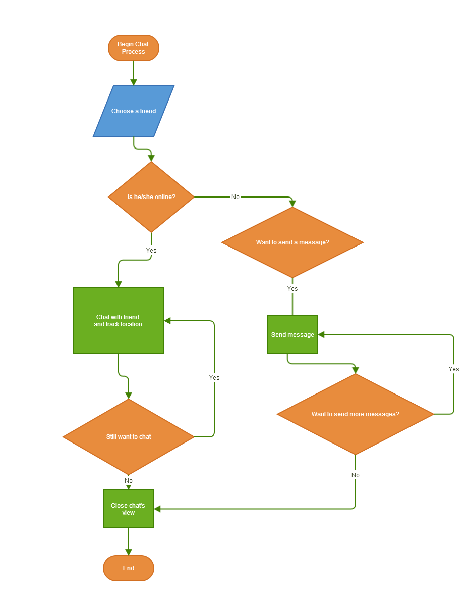

<h4>Team members: Phuc Doan, Zohaib Malik </h4>

<h1>A. Use cases scenario and flow chart</h1>
<h2>1. Some use cases:</h2>
<ul>
  <li>Users enter password and username to login to application so they can use the application.</li>
  <li>Users choose friends from friendlist to chat with other so they can get interact and know their location.</li>
</ul>

<h2>2. Use case scenario: chat with friend </h2>
<ul>
<li>Intial state: Open friend list to choose a friend to chat </li>
<li>(a)If friend is online, user can chat and track location. </li>
<li>(b)If not online, go to (d) </li>
<li>(c)If users still want to chat, then go to back to (a), if not, end of chatting process. </li>
<li>(d)Because friend is not online, you can send message. If you dont want to send message go to end process. If yes, then send message.  </li>
<li>If users dont want to do anything else, end the process.</li>
</ul>

<h2>3.Flowchart from (2) scenario</h2>

<h5>B. User interface</h5>

1.	List the main views of the system 

<ul>
 <li>1: Main page</li>
 <li>2: Online Users</li>
 <li>3: Individual chat /group chat </li>
 <li>4: User Profile</li>
 <li>5: Setting</li>
</ul>

2.	Describe each of the views: what you can see in the view and do with it? What components are included in the view?

1: Main Page:
  Top of page shows the name of application and user own name. 
  In the main page (front page) there is drop menu box, which includes Online Users, Profile (user own profile, clicking   on would lead too profile page), Search (could be used to search users etc.), Setting (clicking on would lead to        setting page).
  Main page also shows recent comment, or other uploads contents. User can post comment. 
  Bottom of main page shows About us (it tells about developers), Contact Information and Feedback, feedback also could   be given through Facebook, Skype, Twitter. 
2: Online users: 
  Online users’ page shows online student on left side and online teachers on right side of page. Room number is also     shown underneath each online user. 
  This page also show comment box, and at bottom it shows chat: which shows Groups’ link (will lead to group page) and    here in the picture, it shows group chat box (this page is minimized) by clicking at top it will enlarge the page       size. 
  Top of page shows name of application, a link to home page and user own name. 

 3.	Draw a wireframe mockup of your views (either using any online editor, MS Visio, paint or simply by hand with pen an   paper + scan) and push them to your github project.
  
There are three pictures, first is main page, second shows online users. And third is individual chat. 
 
4.	Describe the state transitions between the views, what views you can access from a view, and the opposite, what views lead to a specific view?

Main page:
  
  While placing mouse over Online users, underneath it shows groups, clicking on groups would leads to groups page, or clicking on users would lead to online users page. 
  
Online Users: 
  
  By clicking on user name it will take to individual chat page. 
  By clicking over group, will take to group page, where it all groups where user is participating. Clicking over group   will open a new page for chat, as it is shown in center of this picture.
  If user type here, that comment will be shown also on main page.

