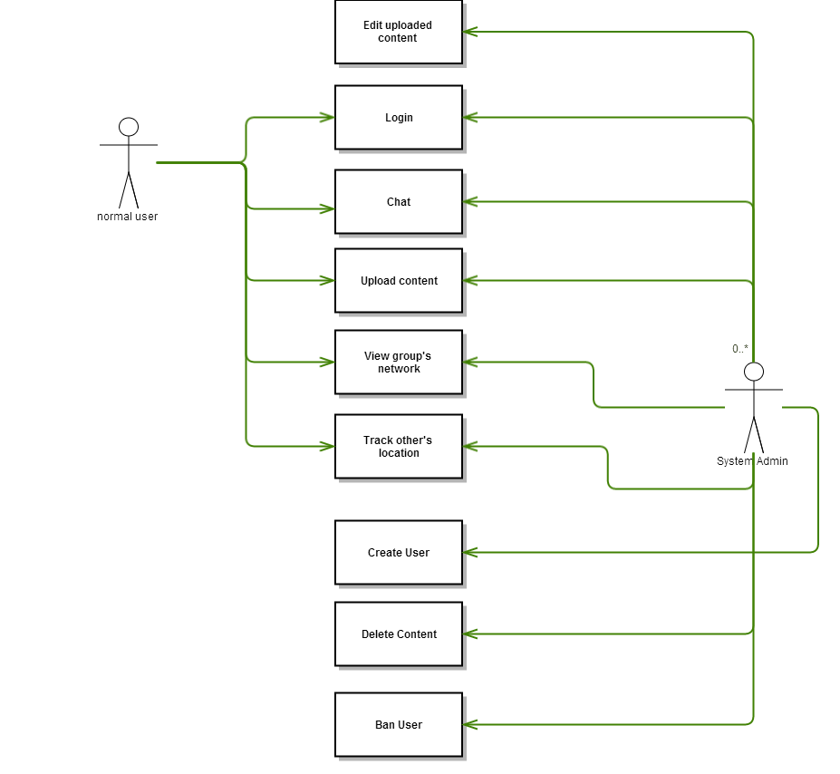
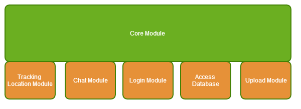
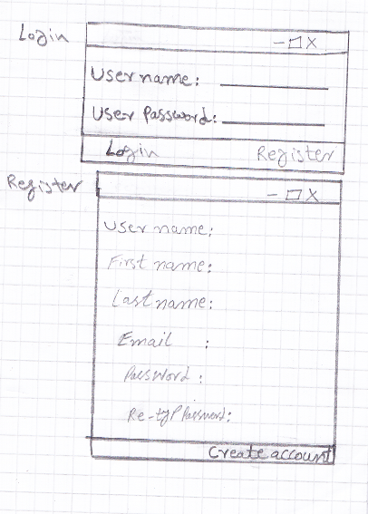
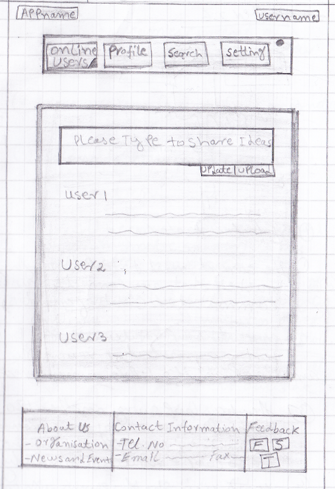
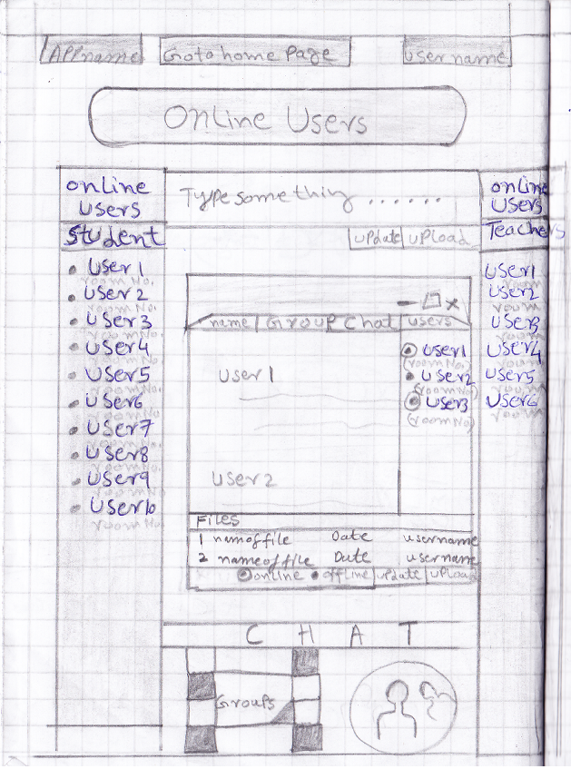
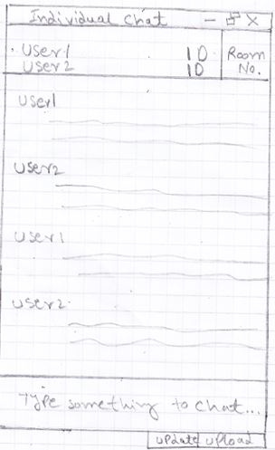

#Introduction
##Project description

The system provides more features to help users communicate easier, by focusing on the friend networking by ID. Therefore, every user can go through his own group (group ID) or chat with others. One is able to update his own status or upload media files, or track his friend’s position.
##System description
This system is targeted to Metropolia students and teachers, in order to create a convenient and dynamic communication environment.

The system will be built on 2 main sides:

* The front-end: the layout, user interface where the users interact with the app.
* The back-end: where the server will receive and process data from the users.Beside, this is where application retrive and store data in database.

For deployment, the core code of application is stored on univerisity server and users can access to application as a web application.

#Use cases
##User group overview
In the system, there are two user groups: normal user (teachers, student...) and system admin group.  For the teacher and student group, they can login using Metropolia ID and will be sort into specific group based on their role on Metropolia ID. One is available to go and check any group’s status, members or uploaded contents.

As for system admin group, this user's role is to manage the whole system both in content and technical aspect of the application. System admins have ability to manipulate content of users from normal user group. Beside, they also have total control of system so if any problems happen, it will be convenient for them to work on that.
##Use case

##Use case scenario 

####Use case: Chat####
* Initial state: Go to web page
* Normal Flow:
	* Login
	* Go to chat interface
	* Choose friends you want to communicate 
	* Begin to chat 
* End state: Exit chat's view
* What could go wrong:
	* If friend is not online, user can choose other one to chat or decide to send an offline message to friend
	* If network has problem, the message or attachment might not be received 
* Other activities: recieve message from other 

####Use case: Upload content####
* Initial state: Go to web page on browser 
* Normal flow:
	* Login
	* Go to upload interface
	* Choose content you want to upload
	* Confirm upload acitivity
	* Content appear on application
* End state: Content appears on view. Exit upload's view.
* What could go wrong:
	* If content format is wrong, system will ask user to input again.
	* If content size is over the limit, system will ask user to input again.
	* If the network has problem, the content cannot be uploaded.
	* If the FTP has problem, the transfering data cannot be complete and your content will lose data compare to origin file.
* Other activities: validating upload content 

####Use case: Login
* Initial state: Go to web page on browser 
* Normal flow:
	* Reach Username/Password
	* Show that login successful 
	* Direct to main page
* End state: Leave users at main's view 
* What could go wrong:
	* If password or username is wrong, prompt to ask email for reseting password or ask for signing up a new account
	* If put wrong password or username more than 5 times in a row, lock that account until user unlock it through the email.
* Other activities:
	* Reset password or create new account if you can login 
	* Lock account if the password or username input is wrong 5 times in a row
####Use case: Edit Content 

* Initial state: Go to browse content interface
* Normal flow:
	* Choose content 
	* Edit content 
	* Confirm edit 
* End state: Show edited content
* What could go wrong: 
	* User can forfeit editing by not confirm then exit
	* User may not have the authority to manage the content, you can only edit your own content or the one that is shared with you
* Other activities: None 

####Use case: View Group's network

-Initial state

*Go to web page on browser 

*Login

*Go to chat interface

*Choose group 

*The group's view will display

*Upload contents or chat with users in the group

*Exit

*End state 

-Branching: 

If the network has problem, the network view will not display

Other activities: None 

####Use case: Track Other's Location

-Initial state

*Go to web page on browser 

*Login

*Go to location interface

*Choose user you want to track location

*Display his/her location

*Exit

*End state

-Branching: 

If the user you track does not share his/her location, it will not display

The location can be delayed, thus of the data transfer processing

-Other activities: None

####Use case: Create User

-Initial state

*Go to web page on browser 

*Choose Add User 

*Put in account information

*Confirm

*Active account through email or sms message

*Try login

*Exit

*End state

-Branching: 

If creating user fails, the system will show errors for the admin( for example: the user or email is available already, the password is not sercure enough, compulsory information was missing)

-Other activities: 

Grant priviliges to users for helping admins manage the application  

 

####Use case: Delete content

-Initial state

*Go to web page on browser 

*Login admin account

*Go to content manage content interface

*Choose content

*Delete content

*Confirm once more

*Exit

*End state

-Branching: 

There is a confirm button if the admin delete something wrong

-Other activities: 

Admin could delete contents by dragging them to the trash box 

There will be a limited amount of memory to store what 'd been deleted, so admin could restore

 

####Use case: Ban User

-Initial state

*Go to web page on browser 

*Login admin account

*Go to content manage user interface

*Choose user

*Choose banned period

*Put banned reason

*Confirm 

*Exit

*End state

-Branching: 

If the admin ban the wrong user, one can unbanned that user

-Other activities: 

Unbanned the user

#System architecture

##Overview

####Presentation tier
In this tier, application provides visual interface of web application to the end-users. Everything is rendered as web application so HTML, CSS and javascript are the the best combination for this task.

####Logic tier
This is where requests from presentation tier are processed. Additionally, logic tier makes queries to data tier to get data and response back to presentation tier to render that information on screen to end user.

####Data tier
This is where data records are stored. Only get interact with logic tier.

##Main Modules 

#Requirements 

##Functional requirements 

Users can communicate each other by chat section and check people’s location 

Users can see Pictures, videos and other media files can be shared. 

Status can be updated in real-time, school’s group lists are categorized. 

Adminstrator can manage users' account 

Administrator can manage all the uploaded content

##Non-functional requirements

####Usability

The application should be easy to use, and the navigation buttons must be clear to locate in the header for example “Back button” to get back to the previous section must be large and easy to recognize. 
Moreover, it should have just 1 tap to login, 2 taps to see and comment in updated contents. 

####Efficiency

We limit the file size to improve the processing speed to make users' experience better 

The layout is simple to help new users use the application easier Functions like 'Search' or 'Help' are placed in the front layout in order to help the user

####Reliability 

The admin of the system is “well trusted” so that user can update everything they want or share, talk about with their friends with no leaked information. 

It is quite important to have the back-up server to prevent the sudden accident that could cause low loading or even crash down the whole application 

The users' information is protected and sercured by system

####Other non-functional requirements 

Speed: The application should be smooth, fast in every devices (especially mobile by J query Mobile 

Flexibility: Application can run with full function on all major browsers PC and mobile: Chrome, Firefox, Safari (on IE) 

Portability: The application run on a server so user can connect throw the net from anywhere.

# User Interface
## Views
1. Login 
2. Register
3. Main page
4. Online Users	
5. Individual chat
6. Groups 
7. Group chat
8. Profile
9. Setting
	
## Description
### Login   
* User name 	
* User password
* Link to registration 

### Register 
* User name
* User password
* First and last name
* Email address

### Main page
* Main menu
* Public chat 
* Other Information
	* Main menu: 
		* Online users (includes link to group page)
		* Profile  
		* Search
		* Setting
	* Public chat: person can upload or update information, it will appear to everyone. 
		 			
	* Other information: 
		* About us (company information)
		* Contact Information 
		* Feedback  
     
### Online Users
		
* Students/ teachers chat: Right section of page shows teachers (name and room Number) who is online and left side of page shows students (name and room number) who are online. Online user shows those online users that are on contact list. 
* Link to group chat: Bottom of page shows a link to group page.
* Type bar: Updates and uploads will appear on main page.  

### Individual chat: 
* Show users names, ID numbers and location (room number). 
* Individual chat takes place when user clicks over other user name.

### Groups: 
* Shows list of groups where user is participating. User can chat by clicking over group name.  

### Group chat:  
* Shows group members who are online and content that they have posted e.g. files and comments.

### Profile:
* User picture
* User application using name
* User first and last name 
* Email address

### Setting: 
* Change password
* Delete group
* Change privacy settings etc. 
         	
## State Transitions
* Main page: Main menu link to online user page and to group page.
* Online users: Link to Group page and main page (public chat).
* Login page to register. And if login is successful main page appears. 

## User Interface Pictures

#Project management, self reflection

With this social network for indoor navigation, we gave our full effort and hardworking. We spend approximately 12 hours per person for three weeks by group work. Our real objective was to learn software engineering phases and documentations. We were really happy to work as team. The team spirit was really high and focusing. Be-sides, it was really nice to know multiculturalism as a group work. 

####Week 1: Requirement and  Designing
Our idea was to implement social network in Indoor Navigation APP. So, we came out of some simple and powerful concept for this project. We mentioned to add chat room by ID, updating status or media file by student as well as teacher. Besides, we can track our Metropolia friends by his/her location. To do this following task we start writing documentation and designing phases. Firstly, we came up with use case diagrams, flow charts, user interfaces and layouts consequently. All this phase are aforementioned in detail.

####Week 2: Implementation
We did not implement our project. We just focused on requirements, new technologies, designing and understanding the documentations.  

####Week 3: Documentation
We followed all the required knowledge based on this course. We had two phases:
pre-hand phase and after-hand phase. We brainstormed, conceptualized, mapped and also focused on new technologies that are available in the market in the first phase. For the next step, we followed more deeply in software works.
      
We estimated that at least two weeks is required to finish this project, however it took us 1 more week. Lacking of documenting and time management skills of our group members are the major reasons.
We would like to continue this project and implement this in real life someday, and hopefully, the teachers and students will find this extra feature interesting.

