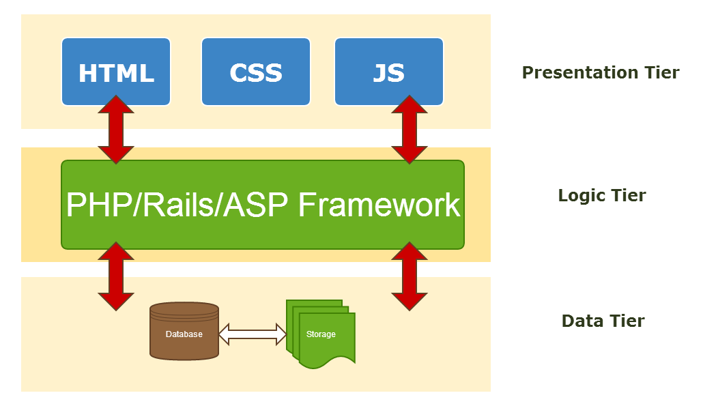

<h1>Introduction</h1>
<h2>Project description</h2>

The system provides more features to help users communicate easier, by focusing on the friend networking by ID. Therefore, every user can go through his own group (group ID) or chat with others. One is able to update his own status or upload media files, or track his friend’s position.

<h2>System description</h2>

This system is targeted to Metropolia students and teachers, in order to create a convenient and dynamic communication environment.

The system will be built on 2 main sides:
<ul>
<li>The front-end: the layout, user interface where the users interact with the app.</li>
<li>The back-end: where the server will receive and process data from the users.Beside, this is where application retrive and store data in database.</li>
</ul>

For deployment, the core code of application is stored on univerisity server and users can access to application as a web application.

<h1>Use cases</h1>
<h2>User group overview</h2> 

In the system, there are two user groups: normal user (teachers, student...) and system admin group.  For the teacher and student group, they can login using Metropolia ID and will be sort into specific group based on their role on Metropolia ID. One is available to go and check any group’s status, members or uploaded contents.

As for system admin group, this user's role is to manage the whole system both in content and technical aspect of the application. System admins have ability to manipulate content of users from normal user group. Beside, they also have total control of system so if any problems happen, it will be convenient for them to work on that.

<h2>Use case</h2> 
[my Flow chart](usercase.png)

lets have some text here

[this is a test](usercase.png)

not to mess with other tags

<h2>Use case scenario</h2> 

<h4>Use case: Chat </h4> 
<ul>
<li>Initial state</li>
<li>Normal flow: choose friend -> begin to chat -> exit </li>
<li>Branching:If friend is not online, user can choose other one to chat or decide to send an offline message to friend</li>
<li>Other activities: recieve message from other </li>
<li>End state </li>
</ul>

<h4>Use case: Upload content </h4> 
<ul>
<li>Initial state</li>
<li>Normal flow: choose content to upload -> upload -> content appear on application. </li>
<li>Branching:If content format is wrong, system will ask to user to input again.</li>
<li>Other activities: validating upload content </li>
<li>End state </li>
</ul>

<h4>Use case: Login </h4> 
<ul>
<li>Initial state</li>
<li>Normal flow: Login -> Username/Password ok -> main page </li>
<li>Branching:If wrong password or username, prompt to ask email for reseting password</li>
<li>Other activities: None </li>
<li>End state </li>
</ul>

<h4>Use case: Edit Content</h4> 
<ul>
<li>Initial state</li>
<li>Normal flow: Choose content -> Edit content -> Confirm edit -> exit </li>
<li>Branching:User can forfeit editing by not confirm then exit</li>
<li>Other activities: None </li>
<li>End state </li>
</ul>

<h4>Use case: View  </h4> 
<ul>
<li>Initial state</li>
<li>Normal flow: Login -> Username/Password ok -> main page </li>
<li>Branching:If wrong password or username, prompt to ask email for reseting password</li>
<li>Other activities: None </li>
<li>End state </li>
</ul>

<h1>System architecture</h1>

<h2>Overview</h2>

<h4>Presentation tier</h4>

In this tier, application provides visual interface of web application to the end-users. Everything is rendered as web application so HTML, CSS and javascript are the the best combination for this task.

<h4>Logic tier</h4>

This is where requests from presentation tier are processed. Additionally, logic tier makes queries to data tier to get data and response back to presentation tier to render that information on screen to end user.

<h4>Data tier</h4>

This is where data records of web application are stored.

<h4>Reason</h4>

With this system architecture, we create a separation between every aspect of application which allows each part to be modified and extended without causing any collision for other parts. Moreover, due to that clients cannot have direct access to data storage so everything go in and out of data storage always go through logic tier to check its correctness which ensure the quality of data for end-users.Furthermore, if errors happends, it will be more easy for developers to track down the location of bugs. 

<h2>Main Modules</h2> 

<h4>Application module</h4> 

<h4>Chat module</h4> 

<h1>Requirements</h1>
<h2>Functional requirements</h2>
<ul>
  <li>Users can communicate each other by chat section and check people’s location</li>
  <li>Users can see </li>
  <li>Pictures, videos and other media files can be shared.</li>
  <li>Status can be updated in real-time, school’s group lists are categorized.</li>
  <li>Adminstrator can manage users' account</li>
  <li>Administrator can manage all the uploaded content</li>
</ul>

<h2>Non-functional requirements</h2>

<h4>Usability</h4>
<ul>
  <li>The application should be easy to use, and the navigation buttons must be clear to locate in the header for example “Back button” to get back to the previous section must be large and easy to recognize. Moreover, it should have just 1 tap to login, 2 taps to see and comment in updated contents.  
  </li>
  <li>The application 
  </li>
</ul>

<h4>Efficiency</h4>
<ul>
  <li>We limit the file size to improve the processing speed to make users' experience better</li>
  <li>The layout is simple to help new users use the application easier</li>
  <li>Functions like 'Search' or 'Help' are placed in the front layout in order to help the user</li>
</ul>

<h4>Reliability</h4>
<ul>
  <li>The admin of the system is “well trusted” so that user can update everything they want or share, talk about with their friends with no leaked information.
  </li>
  <li>It is quite important to have the back-up server to prevent the sudden accident that could cause low loading or even crash down the whole application
  </li>
  <li>The users' information is protected and sercured by system
  </li>
</ul>	

<h4>Other non-functional requirements</h4>
<ul>
  <li>Speed: The application should be smooth, fast in every devices (especially mobile by J query Mobile
  </li>
  <li>Flexibility: Application can run with full function on all major browsers PC and mobile: Chrome, Firefox, Safari (on IE)
  </li>
  <li>Portability: The application run on a server so user can connect throw the net from anywhere.
  </li>
  
</ul>
<h1>User Interface</h1>

<h1>Project management, self reflection</h1>

